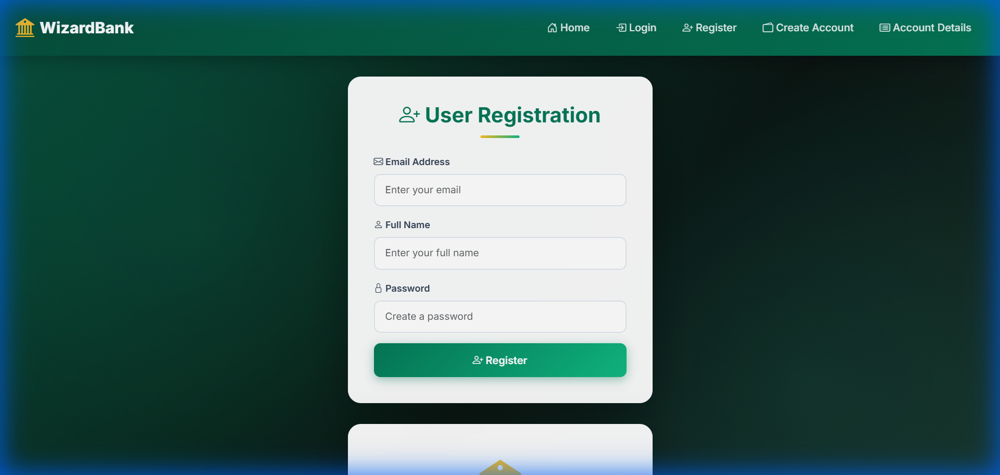
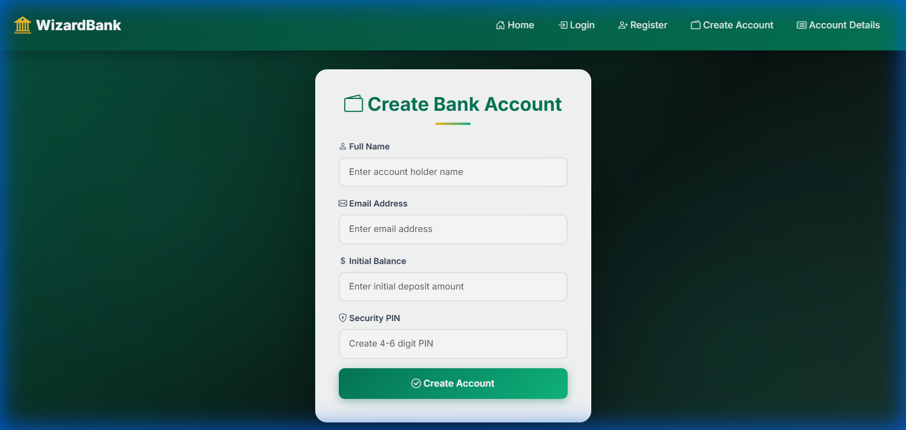
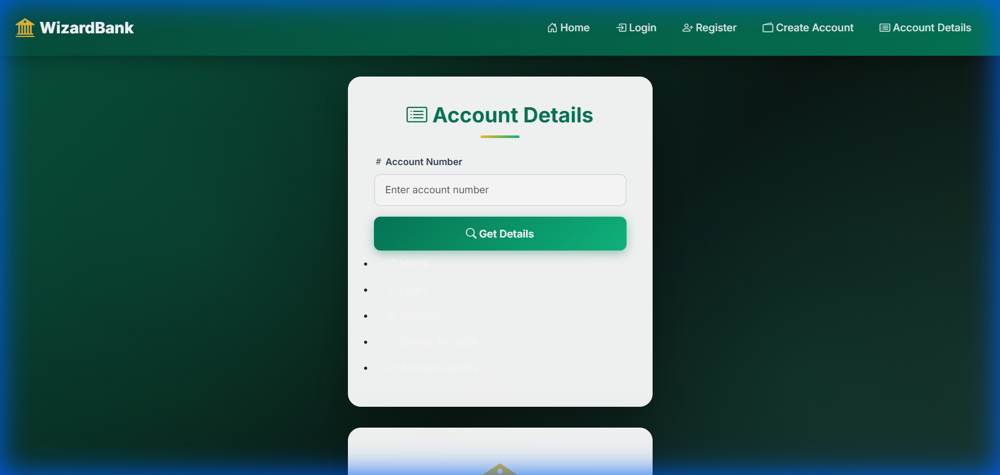

# WizardBank - Modern Banking Management System

WizardBank is a premium, full-stack Banking Management System built with **Spring Boot** and **MySQL**, featuring a stunning, responsive glassmorphic UI.

## ✨ Features

- **Modern UI/UX**: Professional emerald & gold dark theme with smooth animations.
- **User Authentication**: Secure registration and login system.
- **Account Management**: Create bank accounts with initial balances and security PINs.
- **Real-time Account Tracking**: Instantly view account details, balance, and status using account numbers.
- **Responsive Design**: Optimized for both desktop and mobile users.
- **RESTful APIs**: Backend powered by Spring Boot for reliability and speed.

## 🚀 Tech Stack

- **Backend**: Java, Spring Boot (Web, Data JPA)
- **Database**: MySQL
- **Frontend**: HTML5, Vanilla CSS3, JavaScript (ES6+), Bootstrap 5
- **Icons & Fonts**: Bootstrap Icons, Google Fonts (Inter)

## 📸 Project Preview

| Landing Page | Login Page |
|--------------|------------|
|  |  |

| Register Page | Create Account |
|---------------|----------------|
|  |  |

| Account Details |
|-----------------|
|  |

## 🛠️ Installation & Setup

1.  **Clone the Repository**:
    ```bash
    git clone https://github.com/ashishmishra3648/BANKING-MANAGEMENT-SYSTEM.git
    cd banking-management-system
    ```

2.  **Database Configuration**:
    - Create a MySQL database named `banking_db`.
    - Update `src/main/resources/application.properties` with your MySQL username and password.

3.  **Build and Run**:
    ```bash
    mvn spring-boot:run
    ```

4.  **Access the App**:
    Open `http://localhost:8080` in your browser.

## 📁 Repository Structure

- `src/main/java`: Backend controllers, models, and repositories.
- `src/main/resources/static`: Frontend HTML, CSS, and JS.
- `src/main/resources/application.properties`: Configuration file.
- `pom.xml`: Maven dependencies.

---
Created by [Ashish Mishra](https://github.com/ashishmishra3648)
